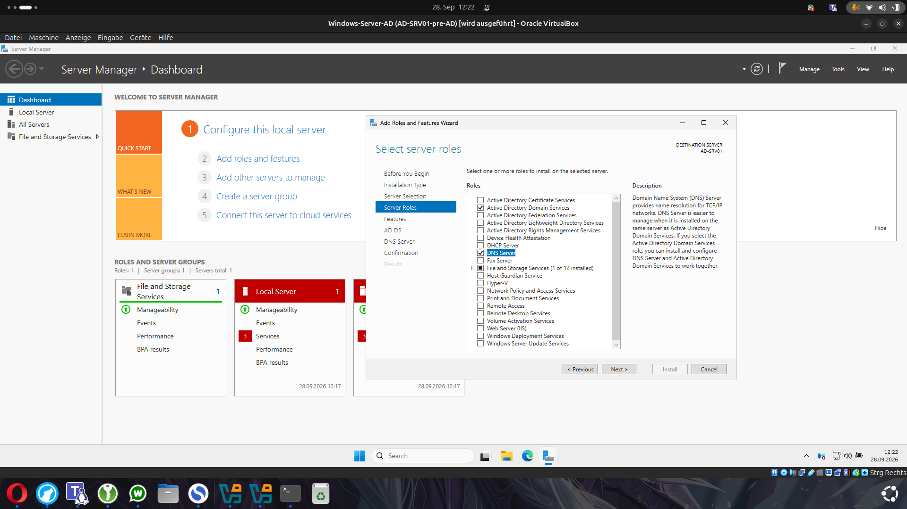
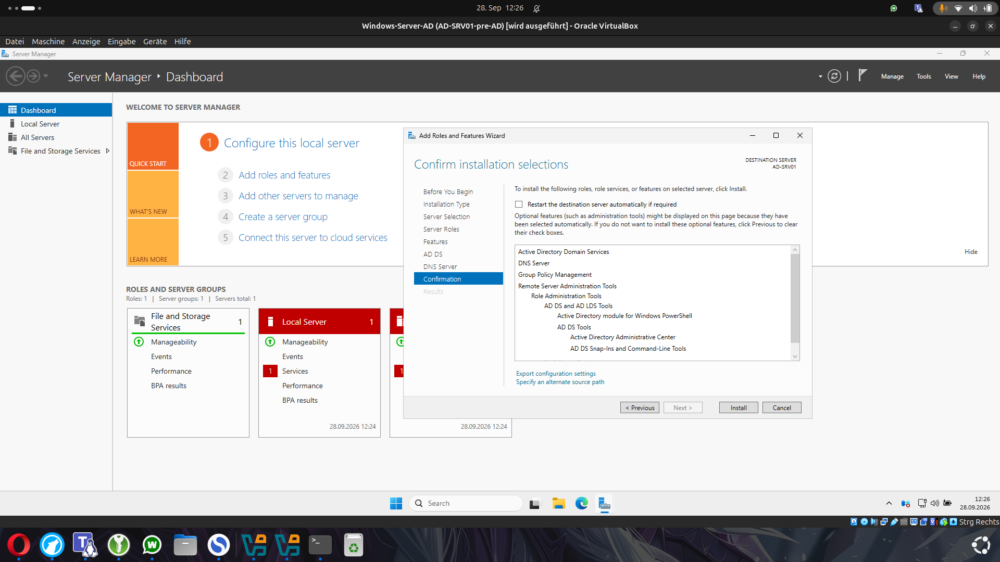
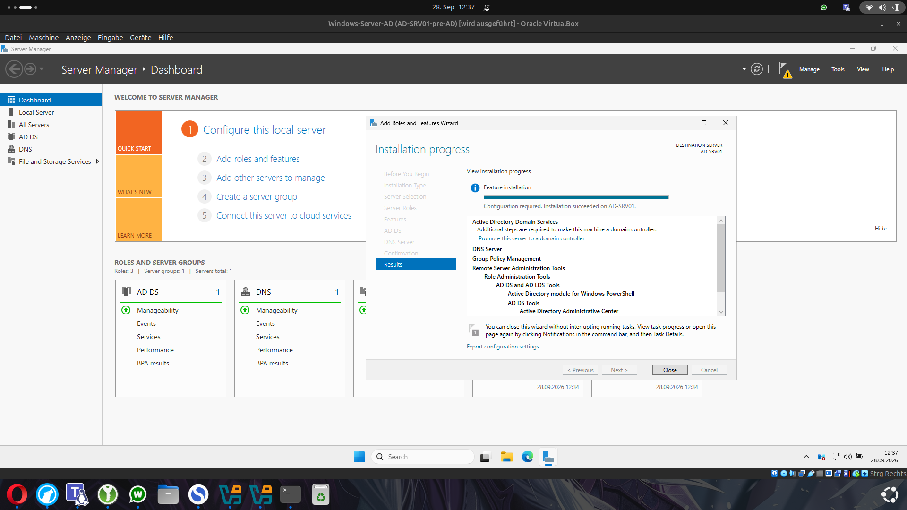

# 04 - Active Directory Domain Services und DNS installieren

## Rollen installieren

Nachdem der Server vorbereitet war, wurden die benötigten Windows-Server-Rollen installiert.

Über den Server Manager wurde der Assistent **Add Roles and Features** geöffnet.

Ausgewählt wurden:

- Active Directory Domain Services
- DNS Server

## Warum beide Rollen?

Active Directory Domain Services verwaltet unter anderem:

- Benutzer
- Gruppen
- Computer
- Domain-Anmeldungen
- Berechtigungen
- Organizational Units

DNS ist für Active Directory sehr wichtig.

Die Clients verwenden DNS nicht nur, um normale Namen aufzulösen, sondern auch um Domain Controller und andere Active-Directory-Dienste zu finden.

Deshalb wurde auf `AD-SRV01` zusätzlich die Rolle **DNS Server** installiert.

## Zusätzliche Verwaltungstools

Bei der Installation wurden automatisch weitere Verwaltungsfunktionen hinzugefügt.

Dazu gehören unter anderem:

- Group Policy Management
- Active Directory Module for Windows PowerShell
- Active Directory Administrative Center
- AD DS Tools
- Remote Server Administration Tools

Diese Werkzeuge werden später für die Verwaltung der Domain verwendet.

## Installation durchführen

Vor der Installation wurde noch einmal kontrolliert, ob der richtige Zielserver ausgewählt war.

In diesem Lab war das:

`AD-SRV01`

Danach wurde die Installation gestartet.

Nach erfolgreicher Installation zeigte der Server Manager:

`Configuration required. Installation succeeded on AD-SRV01`

## Wichtig: Installation ist noch nicht gleich Domain Controller

Nach der Installation der AD-DS-Rolle war der Server noch nicht automatisch ein Domain Controller.

Windows zeigte deshalb den nächsten notwendigen Schritt:

`Promote this server to a domain controller`

Erst durch diese Promotion wird der Server Teil einer Active-Directory-Domain bzw. erstellt eine neue Domain.

Das ist ein wichtiger Unterschied:

- **AD DS Rolle installieren** = Active-Directory-Funktionen auf dem Server bereitstellen
- **Server promoten** = Server tatsächlich zu einem Domain Controller machen

## Typische Fehler an dieser Stelle

Vor der Promotion sollte geprüft werden:

- Der Server besitzt eine feste IP-Adresse
- Der Servername ist korrekt
- DNS und Netzwerk funktionieren
- Windows Updates sind abgeschlossen
- der richtige Server wurde im Assistenten ausgewählt

Besonders eine falsche DNS- oder IP-Konfiguration kann später Probleme beim Domain Join und bei der Namensauflösung verursachen.

Im nächsten Schritt wird `AD-SRV01` zum ersten Domain Controller der neuen Domain `adlab.local` promoted.