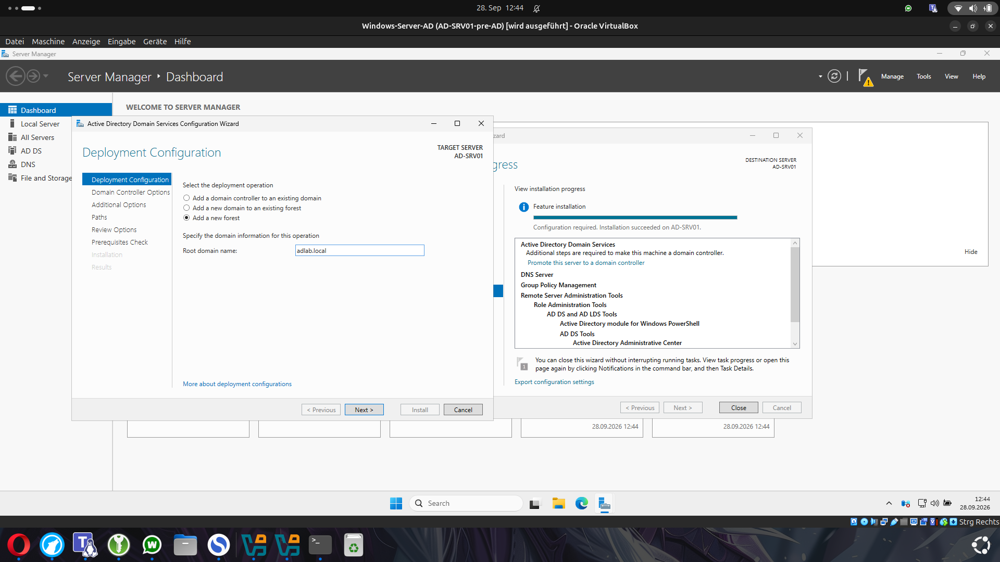
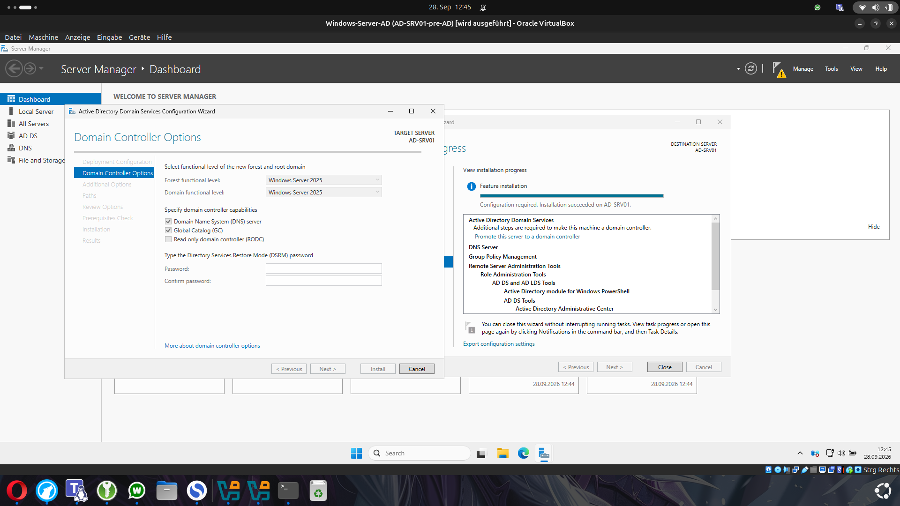
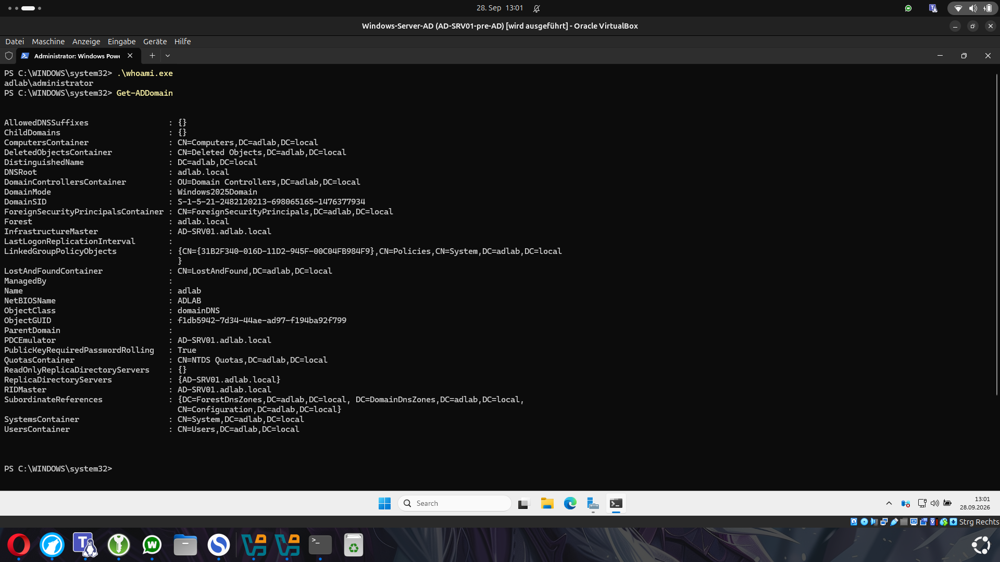
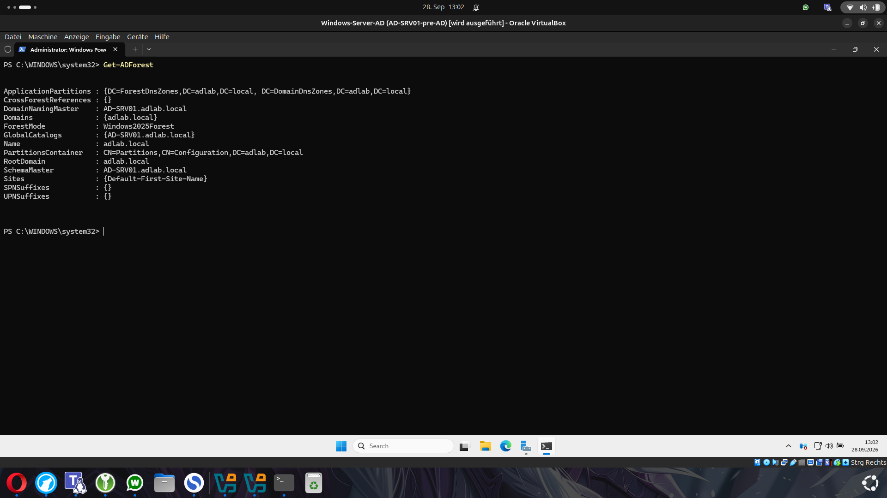

# 05 - Domain Controller einrichten

## Neue Domain erstellen

Nachdem Active Directory Domain Services installiert war, musste `AD-SRV01` noch zum Domain Controller hochgestuft werden.

Da in diesem Lab vorher noch keine Active-Directory-Umgebung existierte, wurde eine komplett neue Gesamtstruktur erstellt.

Im Assistenten wurde deshalb ausgewählt:

`Add a new forest`

Als Root-Domain wurde verwendet:

`adlab.local`

Eine Gesamtstruktur, auch Forest genannt, ist die oberste Ebene einer Active-Directory-Umgebung.

In unserem Lab enthält sie aktuell nur eine Domain:

`adlab.local`

## Domain Controller konfigurieren

Im nächsten Schritt wurden die grundlegenden Einstellungen des Domain Controllers festgelegt.

Verwendet wurden:

| Einstellung | Wert |
|---|---|
| Forest Functional Level | Windows Server 2025 |
| Domain Functional Level | Windows Server 2025 |
| DNS Server | aktiviert |
| Global Catalog | aktiviert |
| Read Only Domain Controller | deaktiviert |

### DNS Server

Der Domain Controller übernimmt gleichzeitig die DNS-Rolle.

Das ist wichtig, weil Active Directory DNS benötigt, um Domain Controller und andere Dienste innerhalb der Domain zu finden.

### Global Catalog

Der Global Catalog enthält Informationen über die Objekte der Active-Directory-Umgebung.

Da `AD-SRV01` aktuell der einzige Domain Controller im Lab ist, wurde er auch als Global Catalog eingerichtet.

### RODC

Die Option **Read Only Domain Controller** wurde nicht aktiviert.

Ein RODC besitzt nur eine schreibgeschützte Kopie bestimmter Active-Directory-Daten und wird zum Beispiel manchmal an weniger geschützten Außenstandorten eingesetzt.

Für unser normales Homelab wird ein vollständig beschreibbarer Domain Controller benötigt.

## DSRM-Passwort

Während der Promotion musste außerdem ein Passwort für den:

`Directory Services Restore Mode (DSRM)`

gesetzt werden.

Dieses Passwort ist nicht das normale Administrator-Passwort.

Es wird für spezielle Wiederherstellungs- und Reparaturarbeiten an Active Directory verwendet und sollte deshalb sicher gespeichert werden.

Das Passwort selbst wird natürlich nicht in diesem Repository dokumentiert.

## Promotion abschließen

Nach der Kontrolle der Einstellungen wurde die Installation gestartet.

Dabei wurde `AD-SRV01` vom normalen Windows Server zu einem Domain Controller für `adlab.local`.

Nach Abschluss der Promotion wurde der Server automatisch neu gestartet.

Ab diesem Zeitpunkt war der Server nicht mehr nur Mitglied einer Workgroup, sondern der erste Domain Controller unserer neuen Active-Directory-Domain.

## Domain überprüfen

Nach dem Neustart wurde zunächst überprüft, unter welchem Benutzerkontext die Anmeldung erfolgt.

Dafür wurde verwendet:

    whoami

Die Ausgabe war:

    adlab\administrator

Damit war zu sehen, dass die Anmeldung jetzt über die Domain `ADLAB` erfolgt.

Anschließend wurde die Domain mit PowerShell geprüft:

    Get-ADDomain

Die Ausgabe bestätigte unter anderem:

- Domain: `adlab.local`
- NetBIOS-Name: `ADLAB`
- Domain Controller: `AD-SRV01.adlab.local`
- Domain Mode: `Windows2025Domain`

Außerdem übernimmt `AD-SRV01` aktuell alle wichtigen Rollen der Domain, da nur ein Domain Controller vorhanden ist.

## Forest überprüfen

Zusätzlich wurde die gesamte Active-Directory-Gesamtstruktur überprüft:

    Get-ADForest

Die Ausgabe bestätigte unter anderem:

- Forest: `adlab.local`
- Root Domain: `adlab.local`
- Forest Mode: `Windows2025Forest`
- Global Catalog: `AD-SRV01.adlab.local`

Damit war bestätigt, dass die neue Domain und der Forest erfolgreich erstellt wurden.

## Ergebnis

Nach diesem Schritt bestand die Umgebung aus einem funktionierenden Domain Controller:

    AD-SRV01
        |
        +-- Active Directory Domain Services
        +-- DNS Server
        +-- Domain: adlab.local
        +-- NetBIOS: ADLAB
        +-- Global Catalog

Der grundlegende Active-Directory-Aufbau war damit abgeschlossen.

Als Nächstes wurde DNS genauer überprüft und eine Reverse Lookup Zone eingerichtet, bevor die ersten Windows-Clients der Domain beitreten konnten.