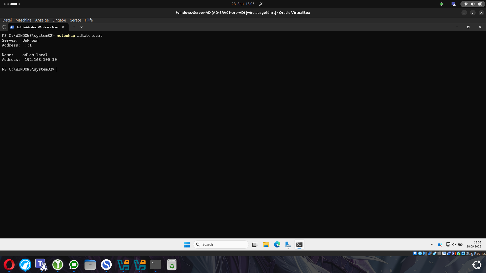
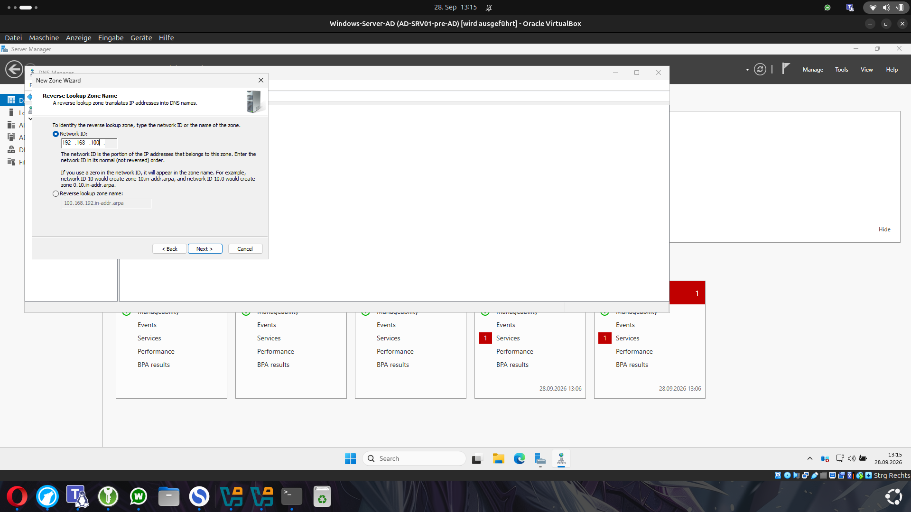
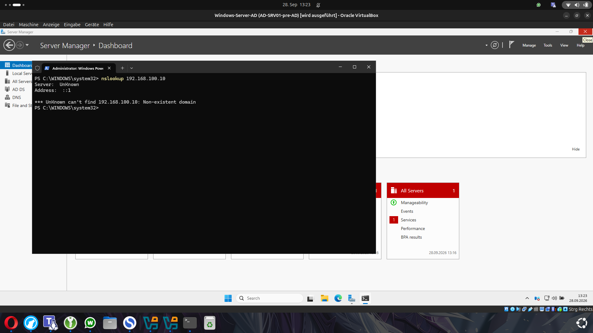
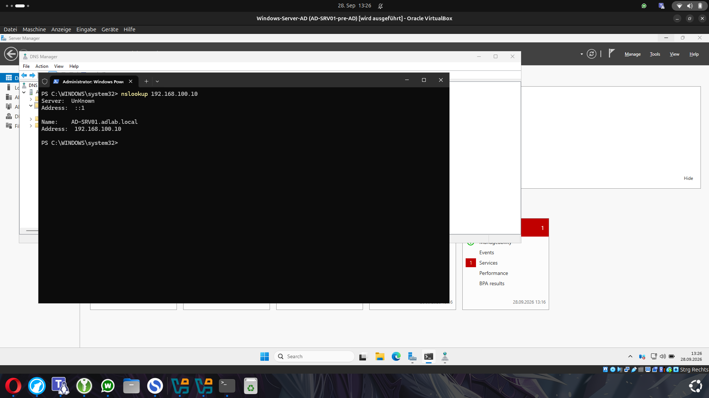

# 06 - DNS konfigurieren und testen

## Warum DNS für Active Directory wichtig ist

DNS spielt in Active Directory eine zentrale Rolle.

Die Clients verwenden DNS nicht nur für normale Namensauflösung im Netzwerk. Sie nutzen DNS auch, um Domain Controller und andere Active-Directory-Dienste zu finden.

Deshalb verwenden die Domain-Clients in diesem Lab `AD-SRV01` als DNS-Server:

`192.168.100.10`

Ein öffentlicher DNS-Server wie `8.8.8.8` wäre für die interne Active-Directory-Auflösung nicht geeignet.

## Forward Lookup testen

Nach der Promotion zum Domain Controller wurde zuerst geprüft, ob die Domain korrekt aufgelöst werden kann.

Dafür wurde verwendet:

    nslookup adlab.local

Die Domain wurde erfolgreich auf die IP-Adresse des Domain Controllers aufgelöst:

    adlab.local -> 192.168.100.10

Damit funktionierte die normale Namensauflösung von Name zu IP-Adresse.

## Reverse Lookup Zone erstellen

Zusätzlich wurde eine Reverse Lookup Zone eingerichtet.

Eine normale DNS-Abfrage funktioniert in diese Richtung:

    Name -> IP-Adresse

Eine Reverse-DNS-Abfrage funktioniert dagegen:

    IP-Adresse -> Name

Für das Netzwerk:

`192.168.100.0/24`

wurde deshalb eine Reverse Lookup Zone mit der Network ID:

`192.168.100`

erstellt.

Windows erstellt daraus die entsprechende Reverse-DNS-Zone.

## Reverse Lookup testen

Nach dem Erstellen der Zone wurde getestet, ob die IP-Adresse des Domain Controllers bereits wieder in einen Namen aufgelöst werden kann:

    nslookup 192.168.100.10

Der erste Test schlug fehl:

    Non-existent domain

Das bedeutete nicht, dass DNS komplett defekt war.

Die Reverse Lookup Zone existierte bereits, aber für `192.168.100.10` gab es noch keinen passenden PTR Record.

## PTR Record erstellen

Ein PTR Record übernimmt bei Reverse DNS die Zuordnung:

    IP-Adresse -> Hostname

Für den Domain Controller wurde deshalb ein PTR Record erstellt:

    192.168.100.10 -> AD-SRV01.adlab.local

Danach wurde der gleiche Test erneut durchgeführt:

    nslookup 192.168.100.10

Diesmal wurde der Server korrekt gefunden.

## Ergebnis

Nach der Konfiguration funktionierten beide Richtungen:

    AD-SRV01.adlab.local -> 192.168.100.10

und:

    192.168.100.10 -> AD-SRV01.adlab.local

Damit war die DNS-Konfiguration für das Lab vollständig funktionsfähig.

Dieser Schritt war besonders wichtig, bevor weitere Windows-Clients der Domain hinzugefügt wurden.

## Troubleshooting

Ein wichtiger Punkt aus diesem Schritt war, zwischen Forward und Reverse DNS zu unterscheiden.

Wenn:

    nslookup adlab.local

funktioniert, aber:

    nslookup 192.168.100.10

nicht funktioniert, bedeutet das nicht automatisch, dass DNS generell kaputt ist.

In unserem Fall fehlte lediglich der PTR Record für die Reverse-Auflösung.

Die Tests mit `nslookup` waren deshalb eine einfache Möglichkeit zu prüfen, welcher Teil der DNS-Konfiguration funktioniert und wo noch etwas fehlt.