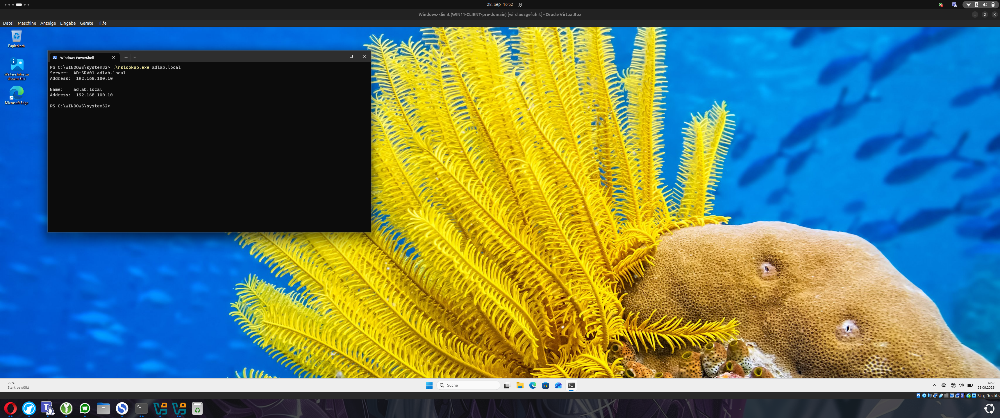
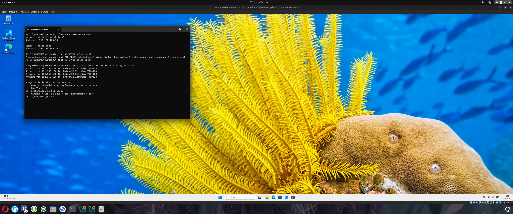
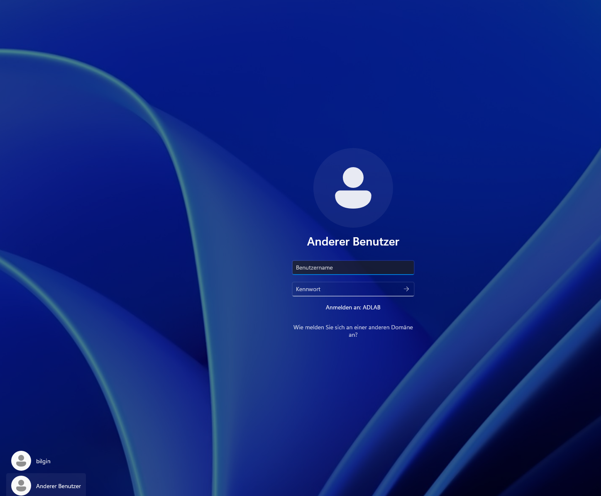
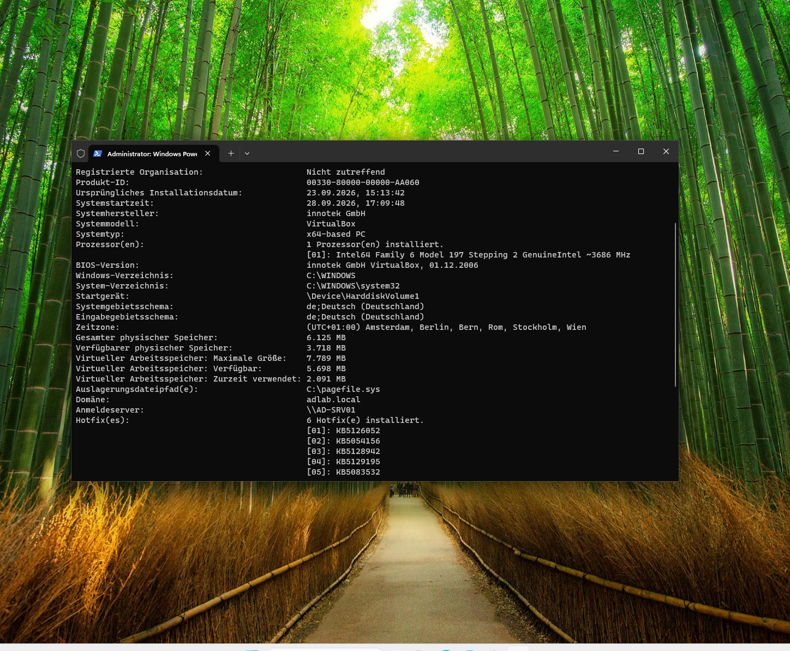
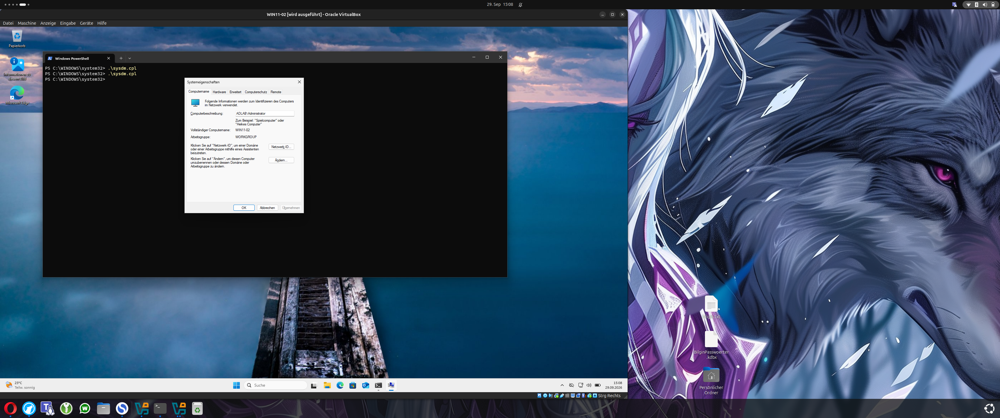

# 07 - Windows-Clients der Domain hinzufügen

## Clients vorbereiten

Nachdem Domain Controller und DNS funktionierten, konnten die Windows-Clients der Domain hinzugefügt werden.

In diesem Lab wurden zwei Windows-11-Clients verwendet:

- `WIN11-CLIENT`
- `WIN11-02`

Beide Clients müssen den Domain Controller über das Netzwerk erreichen können und den internen DNS-Server verwenden.

## DNS des Clients konfigurieren

Der wichtigste Punkt vor dem Domain Join war die DNS-Konfiguration.

Als DNS-Server wurde auf dem Client eingetragen:

`192.168.100.10`

Das ist die IP-Adresse von `AD-SRV01`.

Das ist wichtig, weil der Client die Domain `adlab.local` und den Domain Controller über den internen DNS-Server finden muss.

Ein öffentlicher DNS-Server wie `8.8.8.8` würde die interne Domain nicht kennen.

## Verbindung zum Domain Controller testen

Bevor der Client der Domain hinzugefügt wurde, wurde geprüft, ob DNS und Netzwerk funktionieren.

Dafür wurden unter anderem folgende Befehle verwendet:

    nslookup adlab.local
    ping AD-SRV01.adlab.local

Der Client konnte die Domain korrekt auflösen und den Domain Controller erreichen.

Damit war die wichtigste Voraussetzung für den Domain Join erfüllt.

## Client der Domain hinzufügen

Der Domain Join wurde über die Systemeigenschaften durchgeführt.

Als Domain wurde eingetragen:

`adlab.local`

Für die Anmeldung wurden Domain-Credentials verwendet, zum Beispiel:

`ADLAB\Administrator`

Nach erfolgreichem Join musste der Client neu gestartet werden.

## Domain-Anmeldung

Nach dem Neustart zeigte Windows beim Login:

`Anmelden an: ADLAB`

Damit war klar, dass der Client jetzt Mitglied der Domain war und Domain-Benutzer für die Anmeldung verwendet werden konnten.

## Domain-Mitgliedschaft überprüfen

Zusätzlich wurde die Mitgliedschaft direkt im System überprüft.

Die Ausgabe von `systeminfo` zeigte unter anderem:

    Domäne: adlab.local
    Anmeldeserver: \\AD-SRV01

Damit war bestätigt, dass der Client nicht mehr nur in einer Workgroup arbeitet, sondern zentral über die Active-Directory-Domain verwaltet wird.

## Zweiten Client hinzufügen

Später wurde zusätzlich ein zweiter Windows-11-Client mit dem Namen:

`WIN11-02`

in das Lab aufgenommen.

Auch hier wurde als Domain:

`adlab.local`

eingetragen.

Damit bestand das Lab nicht mehr nur aus einem Server und einem einzelnen Testclient, sondern aus einer kleinen realistischeren Domain-Umgebung mit mehreren Clients.

## Warum das wichtig ist

Der Domain Join ist einer der wichtigsten Schritte in einer Active-Directory-Umgebung.

Erst danach können zentrale Funktionen sinnvoll genutzt werden, zum Beispiel:

- Anmeldung mit Domain-Benutzern
- zentrale Gruppen und Berechtigungen
- Group Policies
- zentrale Dateifreigaben
- Verwaltung von Computerkonten
- spätere Remote-Administration

Die Clients müssen dafür nicht einzeln komplett unabhängig verwaltet werden.

Stattdessen können viele Einstellungen zentral über Active Directory gesteuert werden.

## Ergebnis

Nach diesem Schritt bestand die Umgebung aus:

    AD-SRV01
      |
      +-- Domain: adlab.local
      |
      +-- WIN11-CLIENT
      |
      +-- WIN11-02

Beide Windows-Clients waren Teil der gleichen Active-Directory-Domain und konnten über den Domain Controller authentifiziert und verwaltet werden.

Als Nächstes wurden Benutzer, Gruppen und Organizational Units erstellt, um die Domain sinnvoll zu strukturieren.