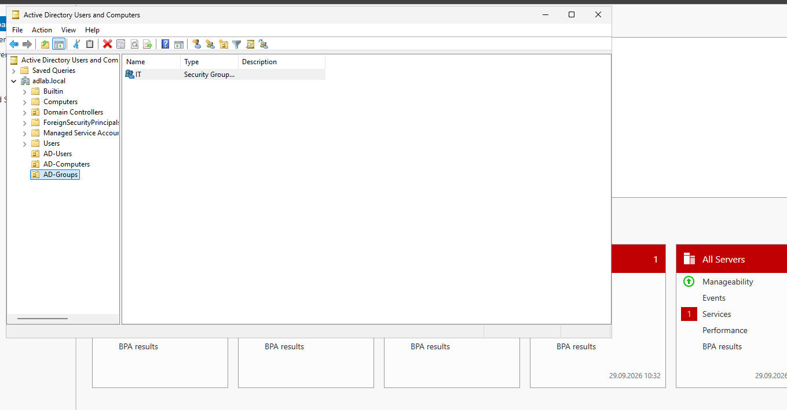
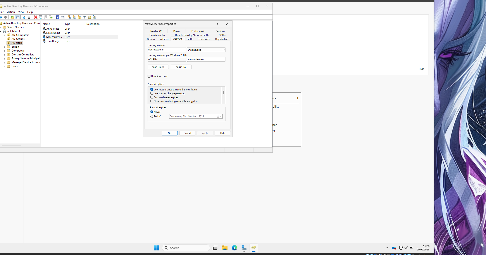
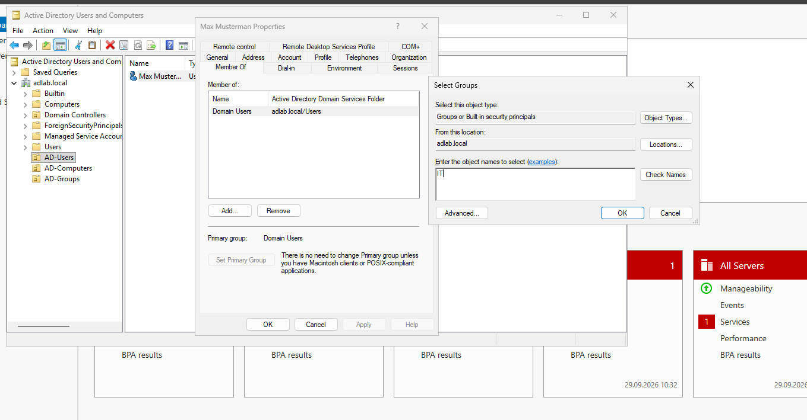
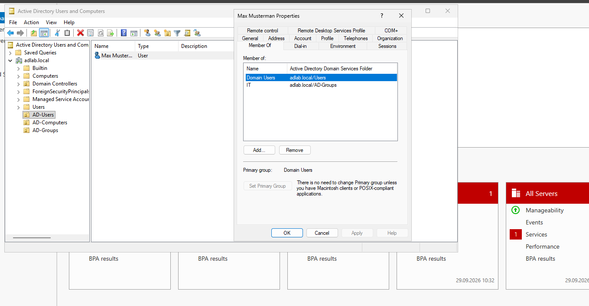
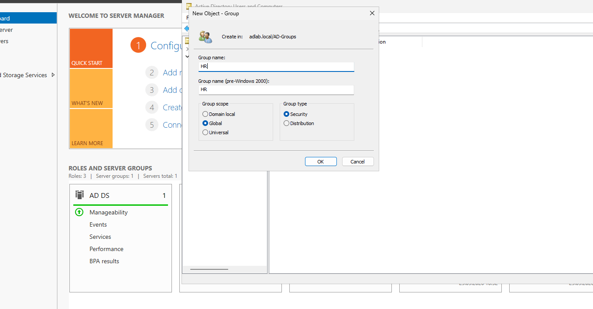
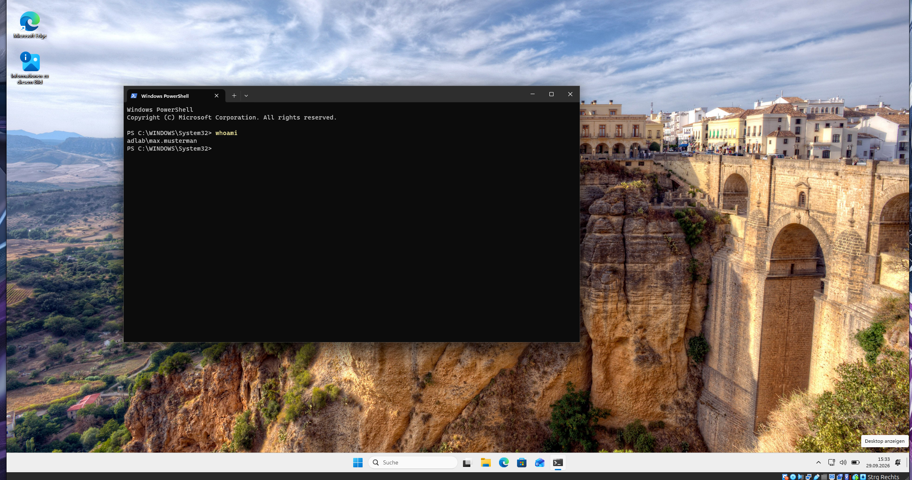

# 08 - Benutzer, Gruppen und OUs verwalten

## Active Directory strukturieren

Nachdem die Clients erfolgreich der Domain beigetreten waren, wurde die Active-Directory-Struktur aufgebaut.

Dafür wurden eigene Organizational Units erstellt, damit Benutzer, Computer und Gruppen übersichtlich verwaltet werden können.

Verwendet wurden unter anderem:

- `AD-Users`
- `AD-Computers`
- `AD-Groups`

OUs helfen dabei, Objekte logisch zu ordnen und später zum Beispiel Group Policies gezielt anzuwenden.

## Sicherheitsgruppen erstellen

Für die verschiedenen Abteilungen wurden Security Groups angelegt.

Beispiele:

- `IT`
- `HR`
- `Sales`
- `Finance`

Die Gruppen wurden als:

`Global`

und:

`Security`

erstellt.

Security Groups können später für Berechtigungen verwendet werden.

Statt einzelnen Benutzern direkt Zugriff zu geben, wird der Zugriff besser über Gruppen gesteuert.

Ein einfaches Prinzip ist:

    Benutzer -> Gruppe -> Berechtigung

Das macht die Verwaltung deutlich übersichtlicher.

## Benutzer erstellen

Danach wurden verschiedene Domain-Benutzer angelegt.

Ein Beispiel ist:

`Max Musterman`

Der Anmeldename lautet:

`max.musterman`

Der Anzeigename und der eigentliche Logon-Name sind nicht immer identisch.

Für die Anmeldung an einem Domain-Client kann zum Beispiel verwendet werden:

    ADLAB\max.musterman

oder:

    max.musterman@adlab.local

## Benutzer einer Gruppe hinzufügen

Max wurde anschließend der Gruppe `IT` hinzugefügt.

Dazu wurde in den Benutzereigenschaften unter **Member Of** die Gruppe `IT` ausgewählt.

Danach konnte geprüft werden, ob die Mitgliedschaft korrekt übernommen wurde.

Max war damit Mitglied von:

- `Domain Users`
- `IT`

## Weitere Abteilungen

Neben IT wurden weitere Gruppen erstellt, zum Beispiel `HR`.

Für das Lab wurden Benutzer verschiedenen Abteilungen zugeordnet.

Beispiel:

| Benutzer | Gruppe |
|---|---|
| Max | IT |
| Anna | HR |
| Tom | Sales |
| Lisa | Finance |

Dadurch können später unterschiedliche Berechtigungen und Richtlinien für die einzelnen Abteilungen getestet werden.

## Anmeldung mit Domain-Benutzer testen

Nachdem Max erstellt und der IT-Gruppe zugeordnet wurde, wurde die Anmeldung auf einem Domain-Client getestet.

Zur Kontrolle wurde in PowerShell ausgeführt:

    whoami

Die Ausgabe zeigte:

    adlab\max.musterman

Damit war bestätigt, dass der Benutzer nicht lokal auf dem Client existiert, sondern direkt aus Active Directory verwendet wird.

## Warum Gruppen wichtig sind

In einer größeren Umgebung wäre es unpraktisch, jedem Benutzer Berechtigungen einzeln zuzuweisen.

Stattdessen werden Benutzer Mitglied einer Gruppe und die Gruppe erhält die benötigten Rechte.

Beispiel:

    Max
      |
      v
    IT Gruppe
      |
      v
    Zugriff auf IT-Ressourcen

Wenn später ein weiterer IT-Mitarbeiter angelegt wird, muss er nur der Gruppe `IT` hinzugefügt werden.

Die Berechtigungen müssen dann nicht erneut einzeln konfiguriert werden.

## Ergebnis

Nach diesem Schritt waren in der Domain mehrere Benutzer, Gruppen und Organizational Units vorhanden.

Die Benutzer konnten sich an Domain-Clients anmelden und ihre Gruppenmitgliedschaften wurden korrekt übernommen.

Damit war die Grundlage für die nächsten Schritte geschaffen:

- Datei- und Ordnerberechtigungen
- Netzwerkfreigaben
- Group Policies
- weitere zentrale Verwaltungsaufgaben