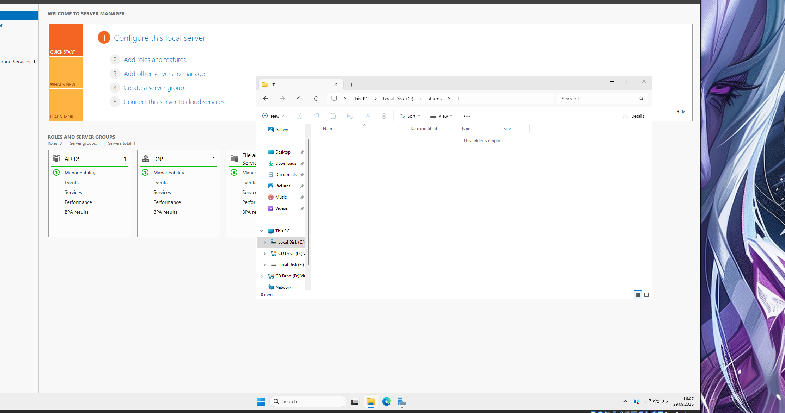
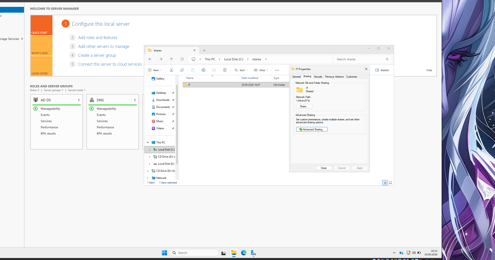
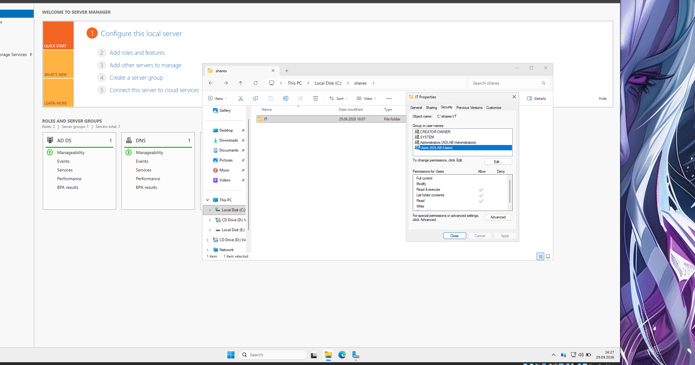
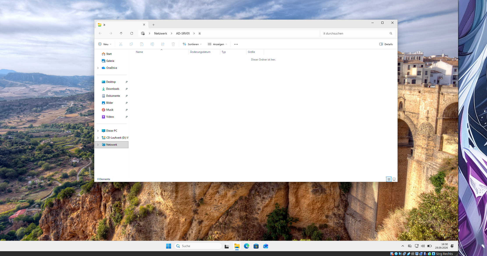
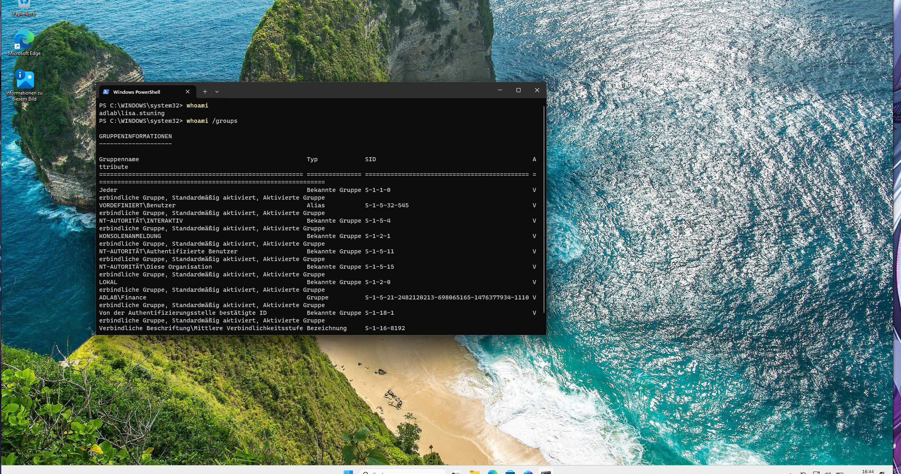
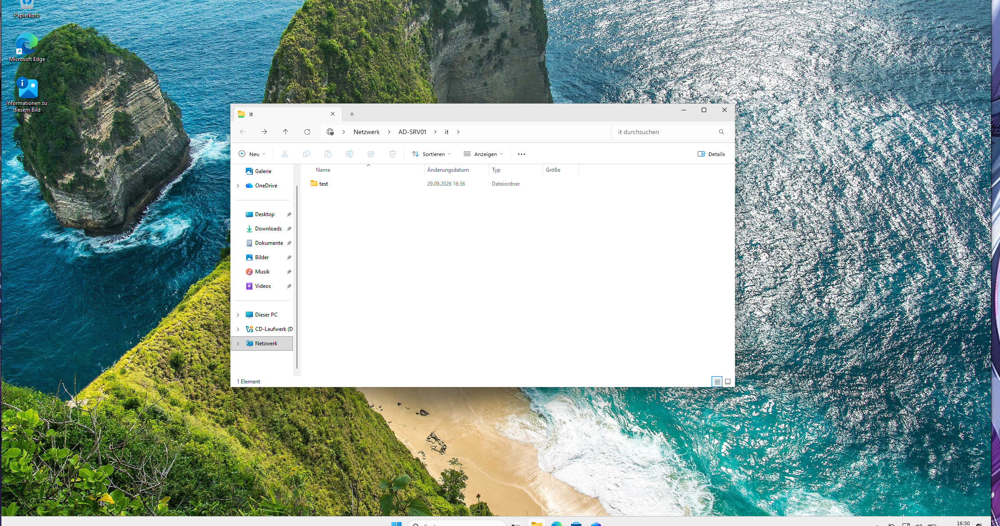
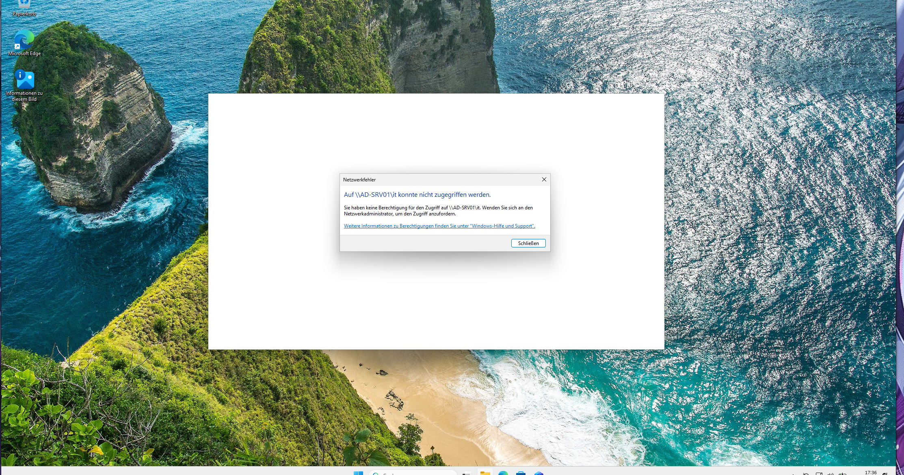

# 09 - Dateifreigaben und Berechtigungen

Nachdem Benutzer und Gruppen in Active Directory eingerichtet waren, sollte eine gemeinsame Netzwerkressource für die IT-Abteilung erstellt werden.

Das Ziel war, einen Ordner auf dem Server freizugeben und anschließend zu testen, welche Domain-Benutzer darauf zugreifen können.

## IT-Ordner erstellen

Auf `AD-SRV01` wurde zuerst ein Ordner für die IT-Abteilung angelegt.

Der Ordner befindet sich unter:

```text
C:\shares\IT
```



Solche zentralen Ordner können später zum Beispiel für gemeinsame Dokumente, Software oder Abteilungsdaten verwendet werden.

## Ordner im Netzwerk freigeben

Anschließend wurde der Ordner als Windows-Netzwerkfreigabe eingerichtet.

Der Zugriff erfolgt über den UNC-Pfad:

```text
\\AD-SRV01\it
```



Ein UNC-Pfad wird verwendet, um eine freigegebene Ressource direkt über das Netzwerk anzusprechen.

Dabei steht:

- `AD-SRV01` für den Server
- `it` für den Namen der Freigabe

## NTFS-Berechtigungen

Neben der eigentlichen Freigabe besitzt der Ordner zusätzlich NTFS-Berechtigungen.



Das ist wichtig, weil bei einer Windows-Dateifreigabe zwei verschiedene Berechtigungsebenen eine Rolle spielen:

- **Share Permissions** regeln den Zugriff über das Netzwerk.
- **NTFS Permissions** regeln den Zugriff auf den Ordner im Dateisystem.

Für den tatsächlichen Zugriff müssen deshalb beide Ebenen berücksichtigt werden.

## Zugriff vom Domain-Client testen

Danach wurde die Freigabe von einem Windows-Client aus geöffnet.



Damit konnte bestätigt werden, dass:

- der Client den Server erreichen kann
- der Servername aufgelöst wird
- die SMB-Freigabe erreichbar ist
- ein Domain-Benutzer grundsätzlich über das Netzwerk auf die Ressource zugreifen kann

Der grundlegende Aufbau war damit:

```text
Domain-Benutzer
      |
      v
Windows Client
      |
      v
\\AD-SRV01\it
      |
      v
Dateifreigabe auf AD-SRV01
```

## Zugriff mit einem anderen Benutzer testen

Danach wurde bewusst ein Benutzer aus einer anderen Gruppe verwendet.

Vor dem Berechtigungstest wurde mit:

```powershell
whoami
whoami /groups
```

überprüft, welcher Benutzer angemeldet ist und zu welchen Gruppen er gehört.



Dieser Schritt ist bei der Fehlersuche sehr hilfreich.

Ein Benutzer kann Mitglied mehrerer Gruppen sein und dadurch Berechtigungen erhalten, die auf den ersten Blick nicht offensichtlich sind.

## Unerwarteter Zugriff

Beim Test stellte sich heraus, dass der Benutzer weiterhin auf die IT-Freigabe zugreifen konnte.



Das war nicht das gewünschte Verhalten.

Eigentlich sollte der Zugriff auf die Ressource über die vorgesehene IT-Gruppe kontrolliert werden.

Damit war klar, dass die vorhandenen Berechtigungen genauer untersucht werden mussten.

## Berechtigungen untersuchen

Auf dem Server wurden deshalb die Berechtigungen des Ordners erneut kontrolliert.



Dabei wurde deutlich, warum es wichtig ist, nicht nur die eigens angelegte Gruppe zu betrachten.

Windows-Ordner können bereits Berechtigungen für allgemeinere Gruppen besitzen oder Berechtigungen von übergeordneten Ordnern erben.

Dadurch kann ein Benutzer Zugriff erhalten, obwohl ihm selbst keine direkte Berechtigung gegeben wurde.

Bei solchen Problemen sollte deshalb immer geprüft werden:

- Welche Gruppen besitzt der Benutzer?
- Welche Share Permissions sind gesetzt?
- Welche NTFS Permissions sind gesetzt?
- Werden Berechtigungen von einem übergeordneten Ordner geerbt?
- Gibt es allgemeine Gruppen wie `Users`, die ebenfalls Zugriff besitzen?

## Berechtigungskonzept

Für die weitere Konfiguration wurde das Prinzip verwendet, Zugriffe möglichst über Active-Directory-Gruppen zu steuern.

Das bedeutet:

```text
Benutzer
   |
   v
AD-Gruppe
   |
   v
Berechtigung
   |
   v
Netzwerkressource
```

Ein Benutzer wird also einer passenden Gruppe zugeordnet und die Berechtigung wird anschließend der Gruppe gegeben.

Das ist übersichtlicher als Berechtigungen einzeln für jeden Benutzer zu konfigurieren.

## Was ich aus diesem Test gelernt habe

Die Freigabe selbst war relativ schnell eingerichtet.

Der interessantere Teil war die Fehlersuche bei den Berechtigungen.

Der Test zeigte, dass ein funktionierender Netzwerkzugriff nicht automatisch bedeutet, dass das Berechtigungskonzept korrekt ist.

Besonders wichtig waren dabei:

- Share- und NTFS-Berechtigungen unterscheiden
- Gruppenmitgliedschaften kontrollieren
- geerbte Berechtigungen beachten
- Zugriff immer mit verschiedenen Benutzern testen

Gerade bei Dateiservern ist das wichtig, weil falsch gesetzte Berechtigungen dazu führen können, dass Benutzer auf Daten zugreifen können, die nicht für ihre Abteilung bestimmt sind.

Damit bestand das Lab inzwischen nicht mehr nur aus einem Domain Controller und einigen Benutzern, sondern enthielt auch eine erste zentral verwaltete Netzwerkressource.